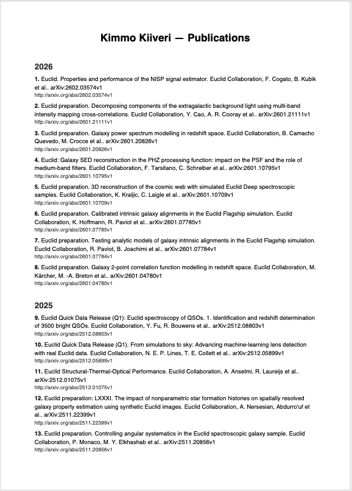

# arXiv Publications PDF Generator

**Automated tool for fetching and maintaining an up-to-date bibliography from arXiv's research database.**

This project demonstrates end-to-end automation using Python, GitHub Actions, and smart change detection. It queries arXiv's API with multiple search strategies, deduplicates results, and generates a clean PDF bibliography — all with automated weekly updates that only commit when new publications are detected.

<p align="center">
  
</p>

## Features

- **Smart API querying**: Multiple name variations (full name, reversed, initials) to maximize recall
- **Intelligent change detection**: Compares latest entry to avoid unnecessary updates
- **Robust error handling**: Defensive checks for missing/malformed API responses
- **Automated workflow**: GitHub Actions with opt-in scheduled updates
- **Clean PDF generation**: Year-grouped bibliographies with ReportLab
- **PNG preview generation**: Automatically generates preview image from first page of PDF
- **Configurable filtering**: Year ranges and author substring matching

## Tech Stack

- **Python 3.11+** with type hints
- **feedparser** for arXiv API integration
- **ReportLab** for PDF generation
- **GitHub Actions** for scheduled automation
- **JSON-based caching** for change detection

## How It Works

1. **Query phase**: Generates multiple search queries (full name, reversed, initials) to maximize recall from arXiv API
2. **Fetch & deduplicate**: Handles pagination, deduplicates by entry ID across queries
3. **Filter & sort**: Applies author substring matching and optional year filtering, sorts newest → oldest
4. **Generate PDF**: Creates year-grouped bibliography with clickable arXiv links
5. **Change detection**: Saves latest entry to `.arxiv_cache`; GitHub Actions compares this to detect new publications
6. **Automated commit**: Only commits when cache differs (i.e., author published something new)

## Installation

Choose one of the two options below. `uv` and `pip` are alternative installers.

### uv

```bash
uv venv
uv pip install -r requirements.txt
```

### pip

```bash
python -m venv .venv
source .venv/bin/activate
pip install -r requirements.txt
```

## Usage

```bash
python make_arxiv_pdf.py --author "Kimmo Kiiveri" --out example_pdf/example_bibliography.pdf
python make_arxiv_pdf.py --author "Kimmo Kiiveri" --from 2013 --to 2026
```

### Optional: Generate PNG Preview

To generate a PNG preview of the first page (requires `poppler-utils`):

```bash
# macOS
brew install poppler
pdftoppm -png -f 1 -l 1 -singlefile example_pdf/example_bibliography.pdf example_pdf

# Ubuntu/Debian
sudo apt-get install poppler-utils
pdftoppm -png -f 1 -l 1 -singlefile example_pdf/example_bibliography.pdf example_pdf
```

## Automated Weekly Updates (GitHub Actions)

A workflow **runs every Sunday at 00:00 UTC** to check for new publications, but is **disabled by default**.

**How it works:**

- The workflow fetches the latest publication from arXiv
- Generates a PDF bibliography and PNG preview (first page)
- Compares against the cached latest entry (`.arxiv_cache`)
- Only updates and commits when a new publication is detected
- No unnecessary commits — updates happen only when content changes

**To enable on your fork:**

1. Go to **Settings → Secrets and variables → Actions → Repository variables**
2. Create: `ENABLE_ARXIV_WORKFLOW = true` (enables the workflow)
3. Create: `AUTO_COMMIT_PDF = true` (enables auto-commit when changes are detected)

If you don't set these variables, the workflow won't run. This way, forks can opt-in to automation.
